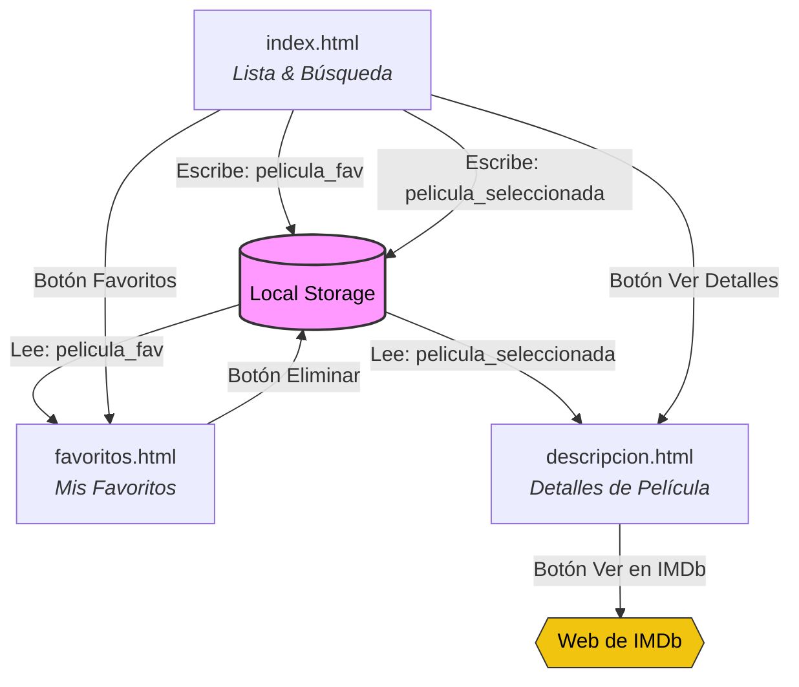

# Cine TV

## Descripcion

**Cine TV** es una plataforma web desarrollada para ver películas y series de forma rápida y sencilla. Es un proyecto de aceso gratuito, se enfoca en una interfaz limpia, responsiva y con una experiencia de usuario inspirada en las grandes plataformas de contenido audiovisual.

## Funcionalidades Core (MVP) 

- Página principal de peliculas
- Página de descripción de una película sen concreto
- Herramienta de búsqueda de peliculas según el título
- Listado de películas favoritas

## Estructura del Prototipo

- **index.html:** Página principal con el listado de películas y con la herramienta de búsqueda. Cuando se realiza la búsqueda, se actualiza el contenido de la página en vez de llevarnos a otra diferente. Cada película aparece con dos botones, uno para añadir a favoritos y otro para ver la descripción y más detalles. 
- **favorito.html:** Página con el listado de películas favoritas con la opción de eliminarlas del listado de favoritos.
- **descripcion.html:** Página con la descripción y los detalles de una película individual. También aparece un botón con el que ir a consultarla y verla a IMDb.

<center>



</center>

## Tecnologías utilizadas


## Enfoque técnico

El desarrollo del prototipo se ha planteado siguiendo los siguientes requerimientos técnicos del proyecto:

- Programación orientada a objetos (POO).
- Manipulación del DOM.
- Uso de `addEventListener` para escuchar y reaccionar a eventos en el DOM.
- Consumo de API mediante el método `fetch`.
- Sistema de búsqueda.
- Guardar preferencias (favoritos) en `localStorage`.
- Visualización de datos en un listado (resultado de búsqueda o favoritos).

## Árbol de archivos
```text
.
├── css/                          # Hojas de estilo CSS
│   ├── descripcion.css
│   └── style.css
├── js/                           # Lógica en JavaScript
│   ├── api.js
│   ├── descripcion.js
│   ├── DOM.js
│   ├── error.js
│   ├── favorito.js
│   ├── index.js
│   └── samples.js
├── img/                          # Imágenes
│   └── sala cine.jpg
├── .gitignore                    # Archivo .gitignore
├── descripcion.html              # Página de descripción
├── favorito.html                 # Paágina de listado de favoritos
├── index.html                    # Página principal
└── README.md                     # Documentación del proyecto
```

## Autores

- [Montse](https://github.com/Montse-gj)
- [Jon](https://github.com/Jaldekoa)
- [Ermidio](https://github.com/Edy1110)
- [Eli](https://github.com/Danzanfer)
